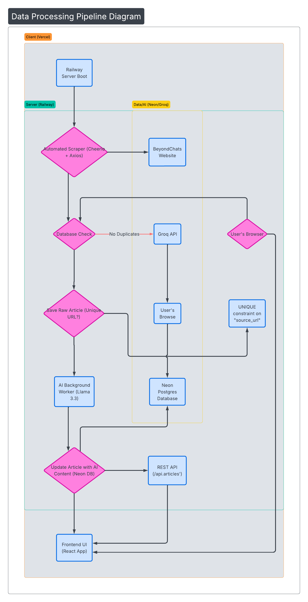
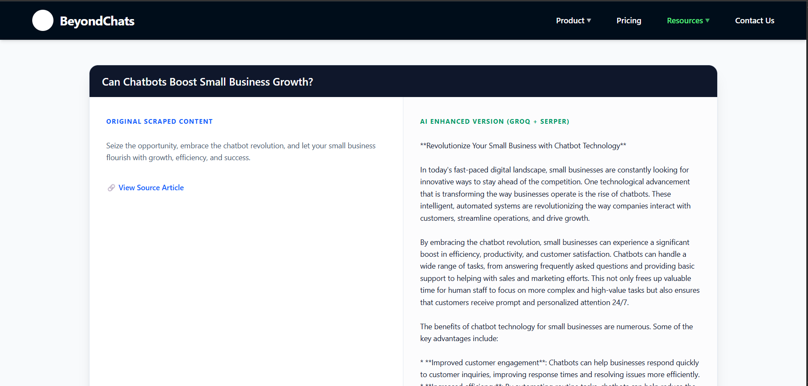

# BeyondChats: AI Content Transformation Engine

An automated system that scrapes legacy blog content, performs competitive research via Google Search, and uses Llama-3 (LLM) to transform and modernize the articles.

## 🔗 Project Links
- **GitHub Repository:** https://github.com/akshita264/beyondchats_akshita_assignment
- **Live Demo (Frontend):** https://beyondchats-akshita-assignment.vercel.app/
- **Backend (Deployed):** https://beyondchatsakshitaassignment-production.up.railway.app/

---

## Tech Stacks Used 
- **Frontend:** React, Vite, Tailwind CSS (Deployed on Vercel).
- **Backend:** Node.js, Express.js (Deployed on Railway).
- **Database:** Neon PostgreSQL.
- **AI Engine:** Groq SDK (Llama-3.3-70b-versatile).
- **Automation:** Integrated background workers in the server lifecycle.
- **Data-Flow Diagram:** Lucid

## 🏗️ System Architecture & Data Flow

*Visualizing the automated pipeline from Railway startup to AI generation and Frontend display.*

1. **Scraper (Phase 1):** Scrapes 5 oldest articles from BeyondChats and stores them in PostgreSQL deployed on NEON.
2. **Processor (Phase 2):** - Fetches articles via Internal CRUD API.
   - Queries **Serper.dev** for top 2 external competitors.
   - Scrapes competitor text and sends it to **Groq LLM** with original content.
   - Appends external citations to the final generated text.
3. **Frontend (Phase 3):** Fetches comparison data and displays it in a responsive React/Tailwind UI.

---

## 🛠️ Local Setup Instructions

### Prerequisites
- Node.js (v18+)
- PostgreSQL Database deployed on NEON
- API Keys: Serper.dev & Groq Cloud

### Backend Setup
1. `cd backend`
2. `npm install`
3. Create `.env` with:
   ```env
   DATABASE_URL=your_neondb_postgres_url
   SERPER_API_KEY=your_key (Your Own keys)
   GROQ_API_KEY=your_key (Your own keys)
   PORT=5000
4. Start Server and AI Compilation: `node server.js`
5. The server will log: [Automation] Triggering startup scrape....

### Frontend Setup
1. `cd frontend`
2. `npm install`
3. Start Dev Server: `npm run dev`

## ⚙️ Key Technical Features
- Smart Filtering: Automatically excludes internal links from competitive research to ensure fresh external context.
- Anti-Bot Scraping: Uses custom headers to bypass scraping blocks on competitor blogs.
- JSONB Storage: Efficiently stores reference arrays in PostgreSQL for frontend mapping.
- Sticky Navbar: Responsive navigation that mirrors the BeyondChats brand identity.

### 📸 Project Screenshots
#### Frontend Interface

*The live frontend showing original scraped content vs. AI-enhanced blog posts*.


